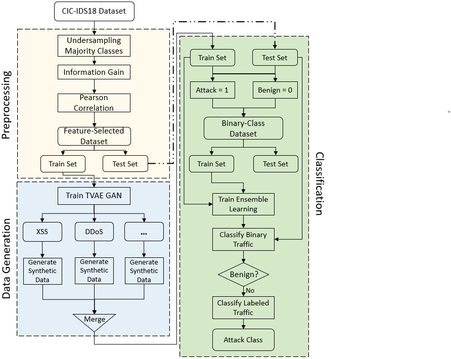

# A-Comprehensive-Multi-Stage-NIDS-Utilizing-GAN-For-Data-Balancing

ECE 9309/9039: MACHINE LEARNING PROJECT

Abstract—The rapid proliferation of internet-connected
devices with varying capabilities and security measures
introduces various security vulnerabilities, which induce
attackers to exploit them to gain access to the network’s
resources, leaving room for newer and more sophisticated
attacks to emerge. Thus, it is mandatory to promptly
design and develop fast and reliable Network Intrusion
Detection Systems (NIDSs) to mitigate such scenarios.
In this work, we propose developing an efficient NIDS
by utilizing Generative Adversarial Networks (GAN) to
overcome the issue of class imbalance and a multi-stage
classification architecture that includes a binary classifier
followed by a multi-class classifier to ensure faster and
more efficient performance. Our proposed approach is
evaluated on the CIC-IDS2018 dataset containing various
up-to-date attacks. Our evaluation results verify the effi-
cient performance of the proposed GAN implementation
and the hierarchical multi-stage architecture. The paper
concludes that the proposed approach resulted in a value of
around 99% for the f1-score, precision, and recall metrics.

Figure 1: The architecture of proposed model.

## Implementation 
### Dataset 
CICIDS2018 dataset, a popular network traffic dataset for intrusion detection problems
* Publicly available at: https://www.unb.ca/cic/datasets/ids-2018.html  
* The sampled subsets of CICIDS2018 is included in this repo in the "[CIC-IDS-2018-Dataset](https://github.com/sarahazzabi/A-Comprehensive-Multi-Stage-NIDS-Utilizing-GAN-For-Data-Balancing/tree/main/CIC-IDS-2018-Dataset)" folder

## Code
* [GAN_playground.ipynb](https://github.com/sarahazzabi/A-Comprehensive-Multi-Stage-NIDS-Utilizing-GAN-For-Data-Balancing/blob/main/GAN_playground.ipynb): code for testing and evaluation of different SDV provided GAN architectures 
* [ML project.ipynb](https://github.com/sarahazzabi/A-Comprehensive-Multi-Stage-NIDS-Utilizing-GAN-For-Data-Balancing/blob/main/ML%20project.ipynb): code for the full model implementation and testing, including preprocessing, feature selection, TVAE-GAN training and sampling, Binary and multiclass classifiers training and evaluation

### Machine Learning Algorithms 
* Decision tree (DT)
* Logistic Regression (LR)
* XGBoost  
* Stacking
* Random forest (RF)

### Requirements & Libraries  
* Python 3.6+ 
* [scikit-learn](https://scikit-learn.org/stable/)  
* [Xgboost](https://xgboost.readthedocs.io/en/latest/python/python_intro.html)
* [sdv](https://sdv.dev/SDV/) 

## Authors
 
[@Omar Awadallah](https://www.linkedin.com/in/omar-awadallah-852b841a1)
[@Sarah Azzabi](https://www.linkedin.com/in/sarah-issa-azzabi/)
[@Yazan Aref](https://www.linkedin.com/in/yazan-aref/)

